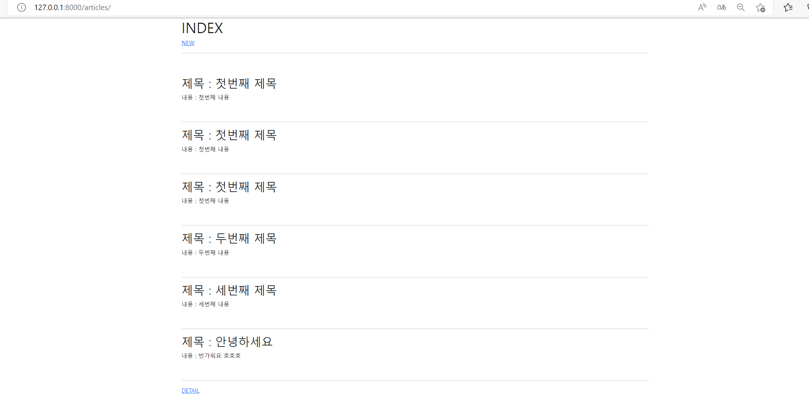

# WorkShop - 0831

---

## Model

## 📸 결과 사진



INDEX 페이지에서는 DB에 있는 게시물을 읽어와서 보여준다.

NEW <a>를 통해 게시물 생성 페이지로 이동할 수 있다.


NEW 페이지에서는 게시물을 작성할 수 있다.

게시물을 작성하면 바로 INDEX 페이지로 넘어가 방금 작성한 글이 반영된 게시물 목록이 표시된다.

또한 BACK <a>를 통해 INDEX 페이지로 돌아갈 수 있다.

## 📂 articles

- articles/model.py
  
  ```python
  from django.db import models
  
  # Create your models here.
  class Article(models.Model) :
      title = models.CharField(max_length=20)
      content = models.TextField()
      created_at = models.DateTimeField(auto_now_add=True)
      updated_at = models.DateTimeField(auto_now=True)
  ```

- articles/urls.py
  
  ```python
  from django.urls import path
  from . import views
  
  app_name = 'articles'
  urlpatterns = [
      path('', views.index, name='index'),
      path('new/', views.new, name='new'),
      path('create/', views.create, name='create'),
  ]
  ```

- articles/views.py
  
  ```python
  from django.shortcuts import render
  from .models import Article
  
  # Create your views here.
  def index(request) :
      articles = Article.objects.all()
      context = {
          'articles' : articles,
      }
  
      return render(request, 'articles/index.html', context)
  
  def new(request) :
      return render(request, 'articles/new.html')
  
  def create(request) :
      title = request.GET.get('title')
      content = request.GET.get('content')
  
      article = Article(title=title, content=content)
      article.save()
  
      articles = Article.objects.all()
      context = {
          'articles' : articles,
      }
  
      return render(request, 'articles/index.html', context)
  ```
  
  ### 📜 articles/templates/
  
  - articles/templates/articles/index.html
    
    ```html
    
    
    
        <h1>INDEX</h1>
        <a href="">NEW</a>
        <hr>
        <br><br>
        
            <h2>제목 : {{ article.title }}</h2>
            <p>내용 : {{ article.content}}</p><br>
            <hr>
        
        <a href="#">DETAIL</a>
    
    ```
  
  - articles/templates/articles/new.html
    
    ```html
    
    
    
        <h1>NEW</h1>
        <form action="" method="GET">
            <label for="title">TITLE : </label>
            <input type="text" name="title" id="title"><br>
            <label for="content">CONTENT : </label>
            <input type="text" name="content" id="content" style="width:200px; height:200px;"><br>
            <input type="submit">
        </form>
        <a href="">BACK</a>
    
    ```

## 📂 crud

- crud/urls.py
  
  ```python
  from django.contrib import admin
  from django.urls import path,include
  
  urlpatterns = [
      path('admin/', admin.site.urls),
      path('articles/', include('articles.urls'))
  ]
  ```

## 📜 templates

- templates/base.html
  
  ```html
  <!DOCTYPE html>
  <html lang="en">
  <head>
      <meta charset="UTF-8">
      <meta http-equiv="X-UA-Compatible" content="IE=edge">
      <meta name="viewport" content="width=device-width, initial-scale=1.0">
      <link href="<https://cdn.jsdelivr.net/npm/bootstrap@5.2.0/dist/css/bootstrap.min.css>" rel="stylesheet" integrity="sha384-gH2yIJqKdNHPEq0n4Mqa/HGKIhSkIHeL5AyhkYV8i59U5AR6csBvApHHNl/vI1Bx" crossorigin="anonymous">
      <title>Document</title>
  </head>
  <body>
      <div class="container">
          
          
      </div>  
      <script src="<https://cdn.jsdelivr.net/npm/bootstrap@5.2.0/dist/js/bootstrap.bundle.min.js>" integrity="sha384-A3rJD856KowSb7dwlZdYEkO39Gagi7vIsF0jrRAoQmDKKtQBHUuLZ9AsSv4jD4Xa" crossorigin="anonymous"></script>
  </body>
  </html>
  ```
